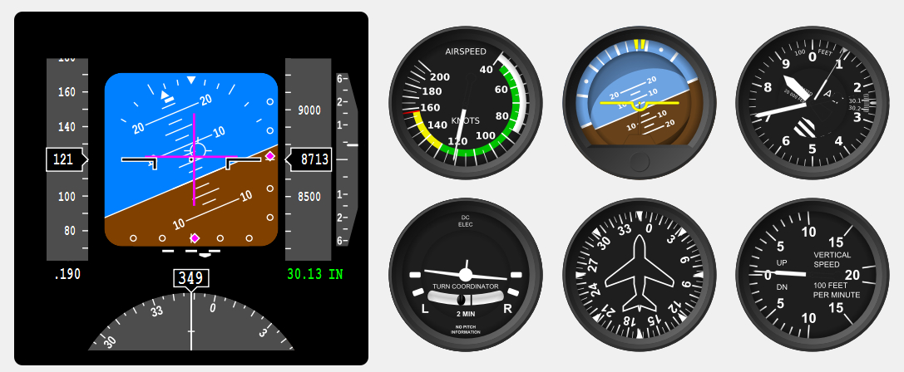

# QFlightinstruments
This is collection of Qt4 and Qt5 widgets of flight instruments, inluding Attitude Indicator, Airspeed Indicator, Vertical Speed Indicator, Turn Indicator, Horizontal Situation Indicator, Primary Flight Display and Navigation Display.

