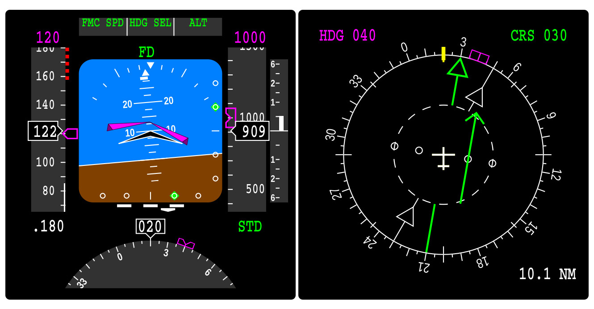
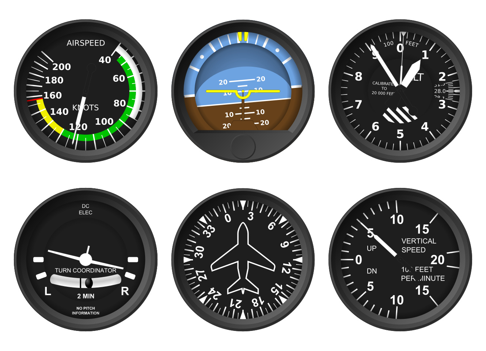
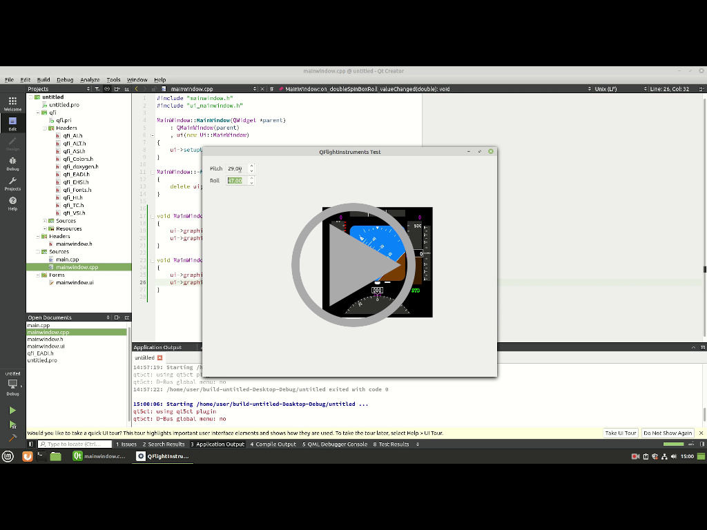

# QFlightinstruments
QFlightinstruments is a collection of flight instruments Qt widgets.

## Components

Project consists of Qt flights instruments library and an example Qt GUI application.

### Electronic Flight Instrument System

* Electronic Attitude Direction Indicator (EADI)
* Electronic Horizontal Situation Indicator (EHSI)



### Basic Six

* Airspeed Indicator (ASI)
* Attitude Indicator (AI)
* Altimeter (ALT)
* Turn Coordinator (TC)
* Heading Indicator (HI)
* Vertical Speed Indicator (VSI)



## Usage

Both flight instruments library and an example application are intended to be built with ```qmake```. There are appropriate Qt Creator project files. Flight instruments library is located in the ```src/qfi/``` directory, it includes source code files, Qt Creator ```pri``` file, Qt Resource Compiler ```qrc``` file and instruments graphics files.

```example1.pro``` project file is intended to build an example application and incorporates instruments library with static linking.

```example2.pro``` project file is intended to build an example application and link to dynamic shared object containing instruments library.

Both projects share the same source code.

```libqfi.pro``` project files allows to create dynamic shared object containing instruments library.

### Creating simple Qt application video

[](https://www.youtube.com/watch?v=3V6-1mbGpxw)

## See also

Visit [http://marekcel.pl/qflightinstruments](http://marekcel.pl/qflightinstruments) for more information.
